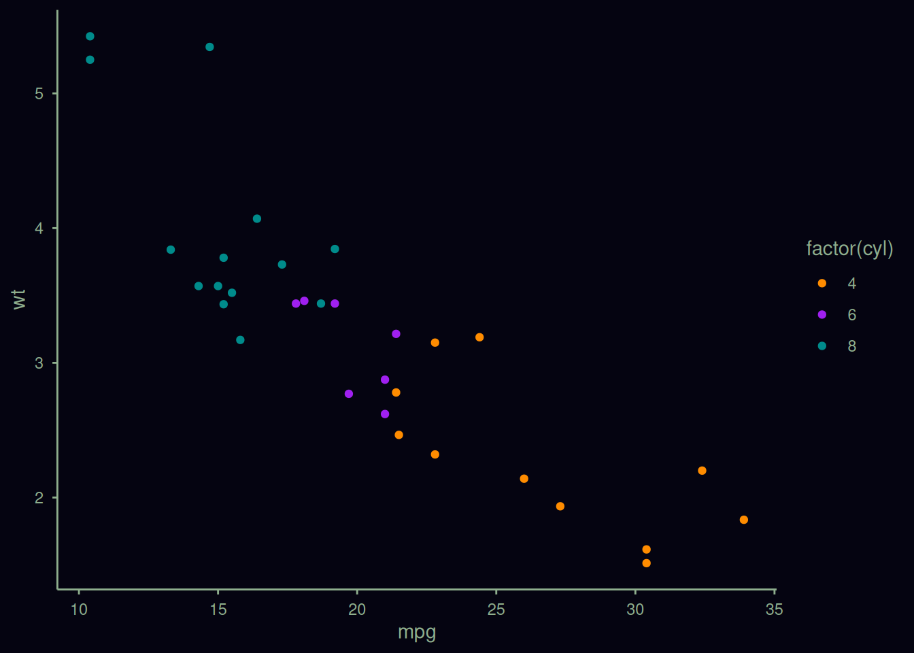
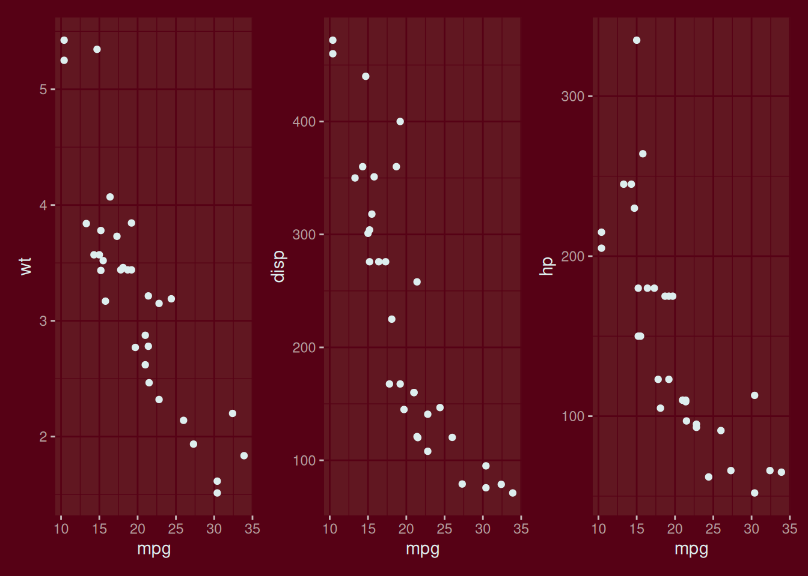

# Theme Helpers

## Overview

The **quarto** package includes helper functions for theming plotting
and table packages.

The functions return theme objects or functions, which are applied
differently depending on the package.

These are simple helper functions to get you started. Copy them if you
to customize them further.

This vignette demonstrates adding background and foreground colors to
outputs from each package using the `theme_colors_*` functions.

Please see [light/dark renderings
examples](https://examples.quarto.pub/lightdark-renderings-examples/ggplot2.html)
for examples using each supported package with dark mode,
`theme_brand_*`, and
[`renderings: [light, dark]`](https://quarto.org/docs/computations/execution-options.html#cell-renderings)

## flextable

Demonstrates a flextable with green foreground and yellow background.

``` r

library(flextable)
library(quarto)

yellow_green_theme <- theme_colors_flextable("#e3e5a9", "#165b26")

ft <- flextable(airquality[ sample.int(10),])
ft <- add_header_row(ft,
  colwidths = c(4, 2),
  values = c("Air quality", "Time")
)
ft <- theme_vanilla(ft)
ft <- add_footer_lines(ft, "Daily air quality measurements in New York, May to September 1973.")
ft <- color(ft, part = "footer", color = "#666666")
ft <- set_caption(ft, caption = "New York Air Quality Measurements")

ft |> yellow_green_theme()
```

| Air quality |  |  |  | Time |  |
|----|----|----|----|----|----|
| Ozone | Solar.R | Wind | Temp | Month | Day |
|  | 194 | 8.6 | 69 | 5 | 10 |
| 18 | 313 | 11.5 | 62 | 5 | 4 |
| 36 | 118 | 8.0 | 72 | 5 | 2 |
| 12 | 149 | 12.6 | 74 | 5 | 3 |
|  |  | 14.3 | 56 | 5 | 5 |
| 19 | 99 | 13.8 | 59 | 5 | 8 |
| 41 | 190 | 7.4 | 67 | 5 | 1 |
| 8 | 19 | 20.1 | 61 | 5 | 9 |
| 28 |  | 14.9 | 66 | 5 | 6 |
| 23 | 299 | 8.6 | 65 | 5 | 7 |
| Daily air quality measurements in New York, May to September 1973. |  |  |  |  |  |

## ggiraph

Demonstrates a ggiraph interactive plot with deep blue background and
mauve foreground.

``` r

library(quarto)
library(ggplot2)
library(ggiraph)

blue_mauve_theme = theme_colors_ggplot2("#111038", "#E0B0FF")

cars <- ggplot(mtcars, aes(mpg, wt)) +
  geom_point_interactive(aes(colour = factor(cyl), tooltip = rownames(mtcars))) +
  scale_colour_manual(values = c("darkorange", "purple", "cyan4"))

girafe(ggobj = cars + blue_mauve_theme)
```

## ggplot2

Demonstrates a ggplot2 plot with near-black background and green-grey
foreground.

``` r

library(quarto)
library(ggplot2)

black_greyn <- theme_colors_ggplot2("#050411", "#8faf8e")

cars <- ggplot(mtcars, aes(mpg, wt)) +
  geom_point(aes(colour = factor(cyl))) +
  scale_colour_manual(values = c("darkorange", "purple", "cyan4"))

cars + black_greyn
```



## gt

Demonstrates a gt table with light green background and black
foreground.

``` r

library(gt)
library(quarto)
library(dplyr)

green_black_theme <- theme_colors_gt("#a5f7d6", "#020202")

islands_tbl <-
  tibble(
    name = names(islands),
    size = islands
  ) |>
  slice_max(size, n = 10)

gt(islands_tbl) |> green_black_theme()
```

| name          | size  |
|---------------|-------|
| Asia          | 16988 |
| Africa        | 11506 |
| North America | 9390  |
| South America | 6795  |
| Antarctica    | 5500  |
| Europe        | 3745  |
| Australia     | 2968  |
| Greenland     | 840   |
| New Guinea    | 306   |
| Borneo        | 280   |

## plotly

Demonstrates a heatmaply interactive heatmap with a dark green
background background and light blue foreground.

``` r

library(quarto)
library(plotly)

green_blue_theme <- theme_colors_plotly("#293a0a", "#a5eff7")

fig <- plot_ly(iris, x = ~Species, y = ~Sepal.Width, type = "violin",
               box = list(visible = TRUE),
               meanline = list(visible = TRUE),
               points = "all")

fig |> green_blue_theme()
```

## thematic

Demonstrates a patchwork plot with dark red background and light grey
foreground.

``` r

library(ggplot2)
library(quarto)
library(patchwork)

darkred_grey_theme <- theme_colors_thematic("#560115", "#ddeeee");

#generate three scatterplots
plot1 <- ggplot(mtcars, aes(mpg, wt)) +
  geom_point()

plot2 <- ggplot(mtcars, aes(mpg, disp)) +
  geom_point()

plot3 <- ggplot(mtcars, aes(mpg, hp)) +
  geom_point()

#display all three scatterplots in same graphic
darkred_grey_theme()
plot1 + plot2 + plot3
```


